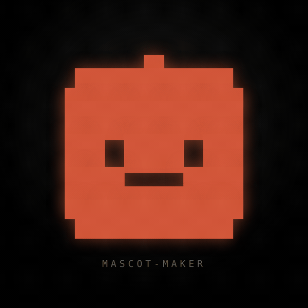
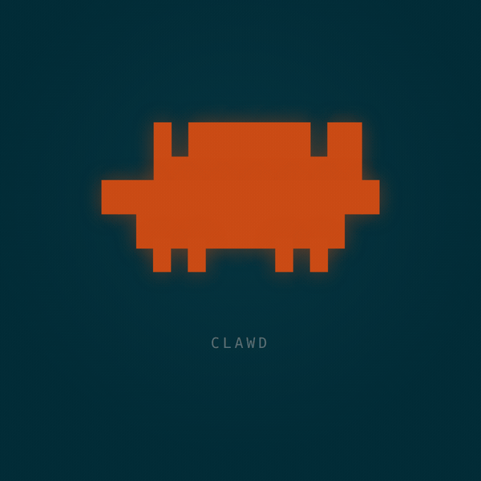
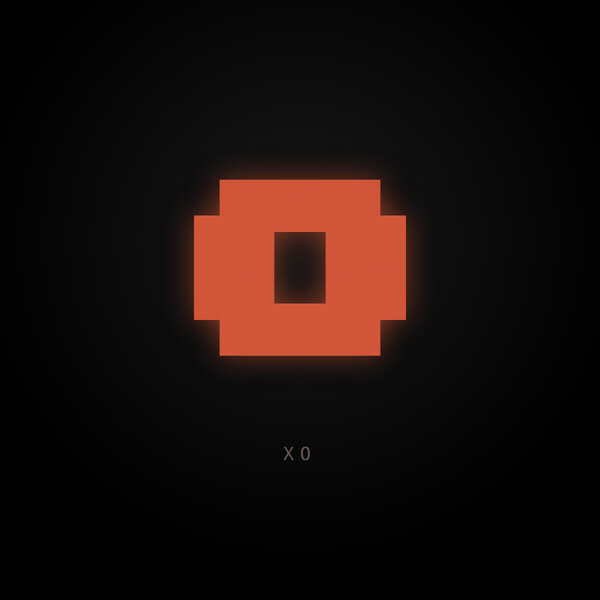
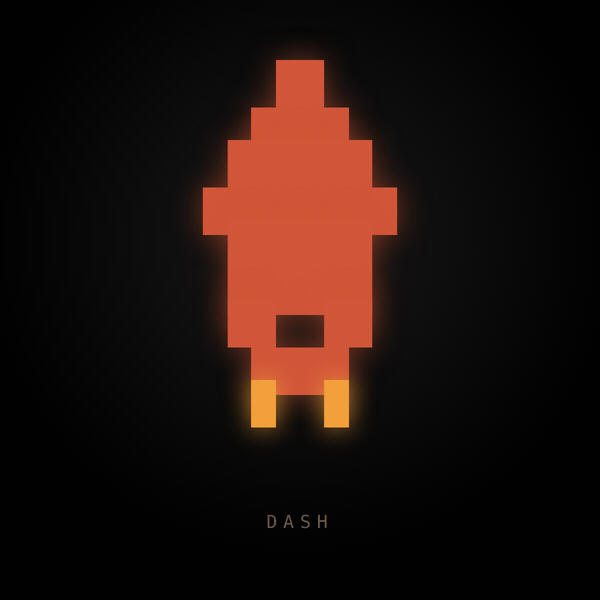
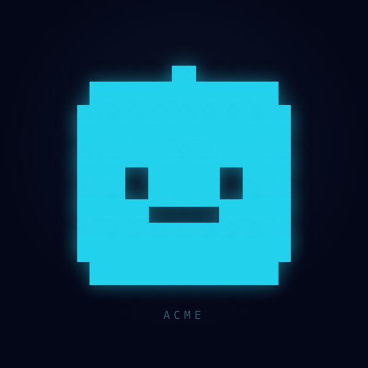
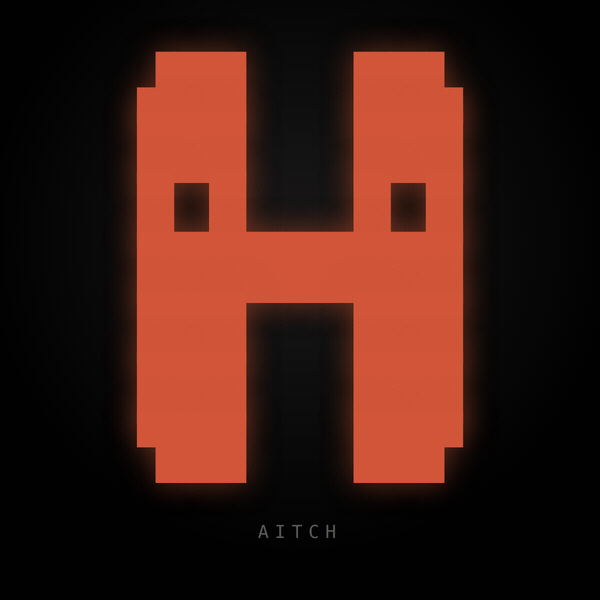

<div align="center">



# mascot-maker

[](LICENSE)
&nbsp;
&nbsp;
&nbsp;
&nbsp;

**An open-source skill that lets any coding agent design and generate animated mascots — and export them as high-quality PNG, GIF, and MP4.**

Recreate the default Claude Code mascot **Clawd**, or invent a brand-new mascot for **your own** product, brand, or platform. Install it in Claude Code, Codex, Cursor, or any agent — then just *ask*.

<table>
<tr>
<td align="center"><br/><b>Clawd</b><br/><sub>default · limbed robot</sub></td>
<td align="center"><br/><b>Xo</b><br/><sub>brand mascot · one-eyed orb</sub></td>
<td align="center"><br/><b>Dash</b><br/><sub>object · rocket w/ thrust</sub></td>
<td align="center"><br/><b>Acme</b><br/><sub>recolor · cyan brand</sub></td>
</tr>
</table>

<sub>☝️ The logo and all four mascots were generated by this skill — the cyan **Acme** is the example prompt below, rendered.</sub>

<sub><b>…even letters.</b> Drop in a glyph and it becomes a monogram mascot:</sub>
<br/>


<sub>MIT licensed · no paid services · pure HTML + Node + ffmpeg</sub>

</div>

---

## Install — just tell your agent

This repo **is** a skill. Point your agent at it once, then describe the mascot
you want and it does the rest.

### 🟣 Claude Code

Tell Claude Code:

> **"Install the mascot-maker skill from https://github.com/ahkamboh/mascot-maker into my skills folder."**

…or do it by hand:

```bash
git clone https://github.com/ahkamboh/mascot-maker ~/.claude/skills/mascot-maker
cd ~/.claude/skills/mascot-maker && ./install.sh claude --deps
```

### 🔵 Cursor

```bash
git clone https://github.com/ahkamboh/mascot-maker /tmp/mascot-maker
/tmp/mascot-maker/install.sh cursor --deps    # vendors to ./tools + writes a .cursor rule
```

### 🟢 Codex / AGENTS.md agents

```bash
git clone https://github.com/ahkamboh/mascot-maker /tmp/mascot-maker
/tmp/mascot-maker/install.sh codex --deps     # vendors to ./tools + adds an AGENTS.md pointer
```

### ⚪ Any other agent (Windsurf, Cline, Aider, Continue, Zed, Gemini CLI…)

```bash
git clone https://github.com/ahkamboh/mascot-maker tools/mascot-maker
```
…then add one line to that agent's instruction file pointing at
`tools/mascot-maker/SKILL.md`. See [`install/other-agents.md`](install/other-agents.md).

> **One-time render dependency:** `npm install && npx playwright install chromium`
> (the `--deps` flag does this for you), plus **ffmpeg** on your `PATH`.

Then just ask:

> *"Design a mascot for my brand **Acme** — colors `#22D3EE` on `#0F172A`, it's a
> developer tool. Give me png, gif, and mp4."*

The agent reads `SKILL.md`, runs the workflow, and drops the assets in `assets/`.

---

## Try it in 30 seconds (no agent needed)

```bash
git clone https://github.com/ahkamboh/mascot-maker && cd mascot-maker
npm install && npx playwright install chromium     # ffmpeg must be on PATH

# render the bundled mascots in all three formats
node scripts/render.mjs --input examples/clawd.html --name clawd --selector .stage --duration 5000
node scripts/render.mjs --input examples/dash.html  --name dash  --selector .stage --duration 4200

# make your own
cp templates/stage.html my-mascot.html             # edit poses + brand colors
node scripts/render.mjs --input my-mascot.html --name my-mascot --selector .stage --duration 4680
```

---

## What you get

| Format | Best for |
|--------|----------|
| **PNG** | README badges, favicons, app icons, social cards |
| **GIF** | GitHub READMEs, tweets, Slack, Discord |
| **MP4** | landing pages, ads, slide decks, anywhere |

The medium is **Unicode Block Elements** (`█ ▀ ▄ ▌ ▐ ▛ ▜ ▙ ▟ …`) — the same
characters Clawd is made of — rendered on a branded stage, captured frame-by-frame
by headless Chromium, and encoded with ffmpeg.

```
concept ─▶ identity ─▶ silhouette ─▶ glyph grid ─▶ states ─▶ loop ─▶ render
                                                                  PNG · GIF · MP4
```

## Demo

Four mascots, one skill — the very `.mp4` output this tool produces, playing inline:

<video src="https://raw.githubusercontent.com/ahkamboh/mascot-maker/main/assets/demo.mp4" width="640" controls muted autoplay loop playsinline></video>

<sub>If the player doesn't load on your client, <a href="assets/demo.mp4">open <code>assets/demo.mp4</code></a> — the previews at the top are GIFs.</sub>

## What's inside

```
SKILL.md                     the workflow your agent follows
AGENTS.md                    auto-discovery pointer for AGENTS.md agents
install.sh                   one-command installer (claude | cursor | codex | here)
scripts/render.mjs           HTML → PNG + GIF + MP4 engine (Playwright + ffmpeg)
templates/stage.html         copy-me starter mascot
examples/clawd.html          default Claude mascot (limbed robot)
examples/xo.html             custom brand mascot (one-eyed orb)
examples/dash.html           object mascot (rocket; animates via exhaust)
examples/mascot-maker.html   the project's own mascot (maker-bot; antenna spark)
examples/acme.html           same maker-bot, recolored for a brand (cyan; winks)
examples/aitch.html          a letterform mascot — the letter "H" (blink · sway · hop)
references/                  design process · block technique · animation ·
                             rendering · brand-mascot playbook
install/                     per-agent install guides
branding/                    social-preview + square-logo source (→ assets/)
assets/                      rendered samples + logo, favicon.ico, social card & demo reel
```

## Design rules (the short version)

1. **Stay inside Block Elements** (`U+2580–U+259F`). They tile seamlessly. Don't
   mix in geometric shapes `◢◣◤◥` — they cause seams.
2. **Test-render at your real font size.** 48–88px on a 600px stage is the sweet
   spot; ~110px breaks half-blocks.
3. **One clear silhouette, internal motion.** Keep the outline stable; animate
   the eye / arms / mouth / thrust.
4. **For a brand mascot, don't clone Clawd.** Steal the brand's colors and tone;
   pick your own body (orb, drop, arrow, flame, fox, comet, rocket).
5. **`--duration` = sum of your sequence ms** → seamless loops. (Headless
   capture runs slower than realtime, so for a single calm loop you can author
   the on-screen timing longer than `--duration` — see the note in
   [`examples/mascot-maker.html`](examples/mascot-maker.html).)

Full details in [`references/`](references/).

## Requirements

- Node 18+
- [Playwright](https://playwright.dev) + Chromium (`npx playwright install chromium`)
- [ffmpeg](https://ffmpeg.org) on your `PATH`

## Contributing

PRs welcome — new silhouette directions, more examples, extra export formats,
install guides for more agents. It's all plain files; fork it and make it yours.
See [`CONTRIBUTORS.md`](CONTRIBUTORS.md).

## Author

Created and maintained by **[Ali Hamza Kamboh (@ahkamboh)](https://github.com/ahkamboh)**
— Co-Founder & CTO @Xaibridge · [alihamzakamboh.com](https://alihamzakamboh.com).

## License

[MIT](LICENSE). Clawd is Anthropic's mascot; the **example** Clawd build here is a
community recreation for teaching the technique.
